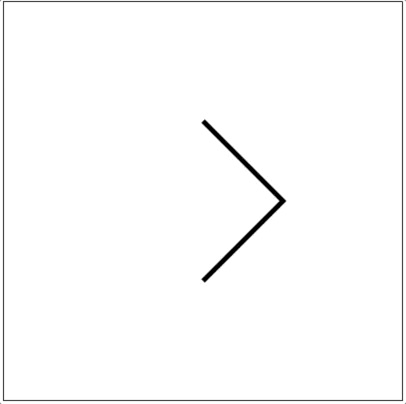
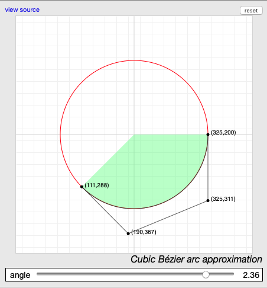
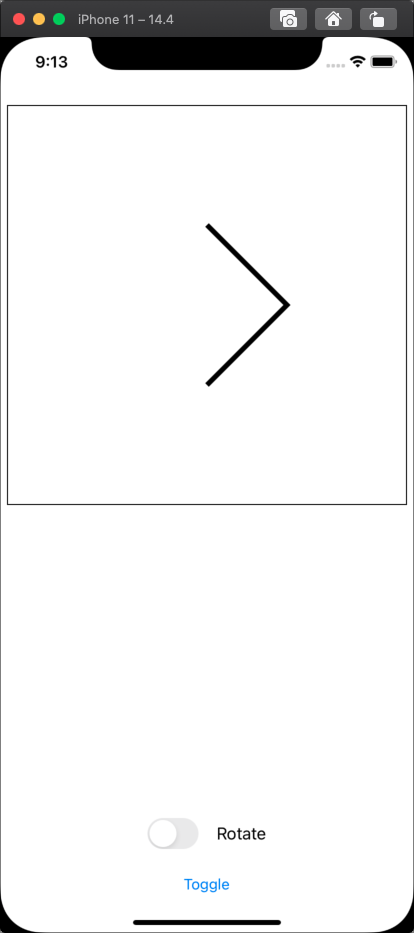

CaretToArcAnimation

This project animates a simple transform of a caret symbol to an arc that spans 3/4 of a circle. It looks like this:



It works by animating the path installed into a CAShapeLayer.

In order for a path animation to work correctly, the starting and ending paths need to have the same number and type of control points.

To animate from the caret to the arc, it creates the caret as 2 cubic bezier curves. The first curve starts at the lower left of the caret, passes through points 1/3 and 2/3 of the way along the lower line segment, and ends at the "bend" in the caret. That creates a Bezier curve that renders as a line segment. The second curve is also a straight line Bezier curve. This one starts at the bend in the caret and ends at the top left corner.

The arc is also composed of 2 cubic bezier curves, drawn in the same dirction as those in the caret symbol. However, the control points for the arc's Bezier curves are chosen so that the resulting curve closely approximates an arc of 3π/2 radians, or 270 degrees, or 3/4 of a cicrcle. The arc is slightly larger than the caret it replaces, and faces the same way.

I use [**this article**](https://pomax.github.io/bezierinfo/#circles_cubic) to get the control points for the two Bezier curves. I didn't feel like figuring out the math, so I just set the curve on that page's interactive arc renderer to draw 3/8 of a circle, wrote down the coordinates of all the control points, and then flipped them to get the second Bezier curve.

Here is a screenshot from the Bezier Arc approximator web simulation I used to find the Bezier control points:



(In that screenshot, the angle slider is expressed in radians. One half of a 3/4 circle arc is 3/8 of a full circle, or 3/8 of 2π. 2π * 3/8 is about 2.36, so that is the arc angle I chose.)

The CaretToArcAnimation app defines a `CaretToArcView` class which is a subclass of `UIView`.

The `CaretToArcView` has a static var `layerClass` which returns `CAShapeLayer.self`. This causes the view's backing layer to be set up as a CAShapeLayer.

The CaretToArcView.swift file defines an enum ViewState:

```
enum ViewState: Int {
    case none
    case caret
    case arc
}
```

The `CaretToArcView` class has a var `viewState` of type `ViewState`. It's initial value is `.none`, meaning no path is installed in the view.

If you set the state to `.caret` or `.arc`, it checks to see if the current layer path is nil. If it is, it installs the appropriate path into the layer without animation.

If the previous path was the other path type, it creates a `CABasicAnimation` with a `fromState` of the previous path, and `toState` of the new path. The animation's duration is set using an instance variable, `animationDuration`. The animation uses ease-in, ease-out timing, although it would be easy to change.

The `CaretToArcView` class also has public function `rotate(_ doRotate: Bool)`. If you call it with `doRotate == false`, it removes all animations from the view's layer. If you call it with  `doRotate == true`, it adds an infinitely repeating rotation animation to the layer, rotating it 360°, over and over, using linear timing.

The app's view controller has logic that prevents it from invoking both animations at the same time (Strange things would happen if you did that. Don't.)

The app's screen looks like this:

